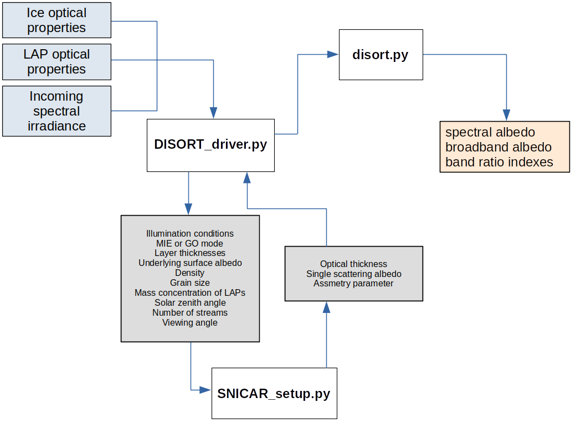
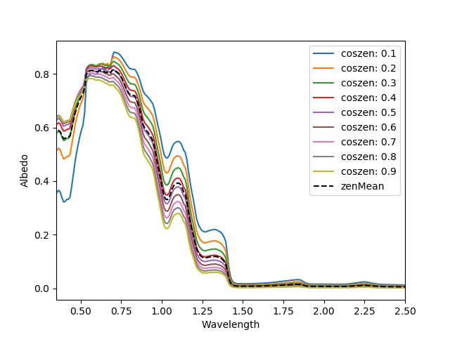

# BioDISORTpy

Original pyDISORT wrapper forked from www.github.com/chanGimeno/pyDISORT 
on  27/11/2019 by J Cook and extended to provide:

a) a wide range of impurities including glacier algae from BioSNICAR_GO 

b) SNICAR-style interface for defining snow/ice/impurity properties 

c) easy iteration over wavelength 

d) calculation of broadband albedo 

e) calculation of common band ratio indexes 

Citation for original DISORT model:
(1) K. Stamnes, SC. Tsay, W. Wiscombe and K. Jayaweera, Numerically
    stable algorithm for discrete-ordinate-method radiative
    transfer in multiple scattering and emitting layered media,
    Appl Opt 27 (1988) (12), pp. 2502–2509.

Citation for SNICAR:
(2) Flanner, M. G., Zender, C. S., Randerson, J. T., and Rasch, P. J. (2007): 
    Present-day climate forcing and response from black carbonin snow, 
    J. Geophys. Res., 112, D11202, https://doi.org/10.1029/2006JD008003.

Citation for BioSNICAR_GO:
(3) Cook, J. M., Tedstone, A. J., Williamson, C., McCutcheon, J., Hodson, A. J.,
    Dayal, A., Skiles, M., Hofer, S., Bryant, R., McAree, O., McGonigle, A., 
    Ryan, J., Anesio, A. M., Irvine-Fynn, T. D. L., Hubbard, A., Hanna, E., 
    Flanner, M., Mayanna, S., Benning, L. G., van As, D., Yallop, M., 
    McQuaid, J. B., Gribbin, T., and Tranter, M.: Glacier algae accelerate melt
    rates on the south-western Greenland Ice Sheet, The Cryosphere, 14, 309–330,
    https://doi.org/10.5194/tc-14-309-2020, 2020.


# Background

This repository was developed in order to extend the utility of pyDISORT to easily
iterate over wavelength, incorporate glacier-melt-relevant light absorbing impurities
and report values such as broadband albedo and band ratio indexes relevant to 
biomass detection from multispectral images. The motivation was to overcome some
of the limitations associated with the two-stream model BioSNICAR_GO (Cook et al. 2020:
github.com/jmcook1186/BioSNICAR_GO_PY) including instabilities at some solar zenith
angles and inability to resolve directional fluxes. The user-interface from BioSNICAR_GO
has largely been transferred over to this package - this offers simple configuration
of DISORT through the driver script instead of the unwieldy text file in the FORTRAN
version. However, advanced users may wish to modify the driver script to define more 
of the available variables - the current driver leaves several variables hard-coded.

This package is built from several scripts plus the pyDISORT wrapper. The driver script
is where the user defines the ice grain size, density, layer thicknesses and 
light absorbing impurity concentrations. The driver calls a second script "setup_SNICAR.py"
which takes the variables defined in the driver and calculates the optical thickness, 
single scattering albedo and asymmetry parameter for the ice column and returns those
to become inputs to the DISORT driver. Iteration over wavelengths and zenith angles 
occurs by multiple calls to DISORT in the driver script.





The schematic above shows the flow of data through the model. The light blue rectangles are
input data, the white boxes with bold text are model scripts and the orange rectangle is 
output data.

# Installation

runs in conda python 2.7 environment "pyDISORT" - start environment or build from
disort_env.yml on Ubuntu 16.04 using:

```
conda env create -f disort_env.yml
```

or build using commands:

```
conda create env -pyDISORT python=2.7 numpy matplotlib

```
Go to the directory where you have checked out the pyDISORT project and run the 
following command:

```
python setup.py install

```

# How to Run

Asfter installing this package, open the driver script and provide values as indicated. 
Run the driver script from the terminal. 

<b>Note that as of 22/05/20 this code will not run on Ubuntu 20.04 </b>
because the package libgfortran3 is not available - recommend this code be run 
on an earlier release - 16.04 is fine. 

<b>NOTE THAT THE OPICAL PROPERTY DATA IS NOT INCLUDED IN THIS REPOSITORY! </b> Please download
the data directory from www.github.com/jmcook1186/BioSNICAR_GO_PY/ and save it inside BioDISORTpy
so that the folder structure is as shown below:

```
bioDISORTpy
|
|----- _disort_pyf_
|----- DISORT.doc
|----- DISORT_driver.py
|----- DISORT_env.yml
|----- get_params.py
|----- setup.py
|----- setup_SNICAR.py
|----- LUTbuilder.py
|----- LUTbuilder_clean.py
|----- README.md
|
|-----assets
|        |-...
|
|-----build
|       |...
|
|-----Data
|       |...
|
|-----doc
|      |...
|
|-----lib
|      |...
|
|-----src
|      |...
|
|-----test
|      |...
|

```

# Outputs

Two plots are saved to the fig_path. First is the hemisphere-integrated spectral
albedo at the surface. The second is the broadband albedo at the surface at each 
viewing angle.




In addition several output values are output to the terminal. These are the values for 
a range of band ratio indexes relevant for remote sensing biomass quantification and
the broadband albedo.

# Notes

DISORT in its original form is a <b>monochrome</b> radiation transport model. To run it
spectrally over a waveband requires the valuesof ssa, tau, phase function/asymmetry
parameter etc to be provided as arrays from the shortest wavelength to the longest.
i.e. DISORT does not treat wavelength explicitly, but implicitly in that the values 
provided for the input variables are mostly wavelength dependent.

The driver script offers the option to run in MIE or GO mode - this changes the
origin of the ice optical properties - either Mie scattering or Geometrical Optics.
The former is good for small, dry snow modelling where the assumption of small spherical
particles is appropriate. GO mode is more appropriate for large, aspherical ice crystals.
In this case the GO calculations were based on hexagonal columns.


# DISORT parameters

The following definitions can be accessed in terminal using command >> help(disort.run)

    Parameters
    ----------
    dTau : array
        optical thickness in atmospheric layers
    w0 : float, array
        single scattering albedo (Default: 1.)
    iphas : int, array
        scattering phase function type (Default 2).
        1 : Isotropic
        2 : Rayleigh
        3 : Henyey-Greenstein with asymmetry factor GG
        4 : Haze L as specified by Garcia/Siewert
        5 : Cloud C.1 as specified by Garcia/Siewert
    gg : float, array
        scattering asymmetry parameter (Default: 0.85)
    umu0 : float
        cosine of solar zenith angle (Default: 1.)
    phi0 : float
        solar azimuth angle (Default: 0.)
    albedo : float
        surface albedo (Default: 0.1)
    fbeam : float
        solar irradiance (Default: 1.)
    utau : float, array
        optical thickness where to output the RT fields (Default: 0.)
    umu : float, array
        cosine of viewing zenith angle where to output the RT fields (Default: 1.)
    phi : float, array
        viewing azimuth angle where to output the RT fields (Default: 0.)
    maxmom : int
        Max. number of Legendre coefficients. (Default: 299)
    Nstr : int
        Number of computational polar angles to be used
        (= number of 'streams')  ( should be even and .GE. 2 ).
        (Default: 32)
    temp : float, array
        LEV = 0 to NLYR, Temperatures (K) of levels.
        (Note that temperature is specified at LEVELS
        rather than for layers.)  Be sure to put top level
        temperature in TEMPER(0), not TEMPER(1).  Top and
        bottom level values do not need to agree with top and
        bottom boundary temperatures (i.e. temperature
        discontinuities are allowed).  (Default: 300.)
    wvnmlo, wvnmhi : float
        Wavenumbers (inv cm) of spectral interval of interest
        ( used only for calculating Planck function ).
        Needed only if PLANK is TRUE, or in multiple runs, if
        LAMBER is FALSE and BDREF depends on spectral interval.
        (Default: wvnmlo=999., wvnmhi=1000.)
    UsrTau : logical
        = FALSE, Radiant quantities are to be returned
                     at boundary of every computational layer.
        = TRUE,  Radiant quantities are to be returned
                     at user-specified optical depths
        (Default: True)
    UsrAng : logical
        = FALSE, Radiant quantities are to be returned
                     at computational polar angles.
        = TRUE,  Radiant quantities are to be returned
                     at user-specified polar angles.
        (Default: True)
    ibcnd : int
        = 0, General case: boundary conditions any combination of:
             * beam illumination from the top ( see FBEAM )
             * isotropic illumination from the top ( see FISOT )
             * thermal emission from the top ( see TEMIS, TTEMP )
             * internal thermal emission sources ( see TEMPER )
             * reflection at the bottom ( see LAMBER, ALBEDO, BDREF )
             * thermal emission from the bottom ( see BTEMP )
        = 1, Return only albedo and transmissivity of the entire
             medium vs. incident beam angle; see S2 for details.
        (Default: 0)
    fisot : float
        Intensity of top-boundary isotropic illumination.
        [same units as PLKAVG (default W/sq m) if thermal
        sources active, otherwise arbitrary units].
        Corresponding incident flux is pi (3.14159...)
        times FISOT.
        (Default: 0.)
    lamber : bool
        = TRUE, isotropically reflecting bottom boundary.
        = FALSE, bidirectionally reflecting bottom boundary.
        (Default: True)
    btemp : float
        Temperature of bottom boundary (K)  (bottom emissivity
        is calculated from ALBEDO or function BDREF, so it need
        not be specified). Needed only if PLANK is TRUE.
        (Default: 300.)
    ttemp : float
        Temperature of top boundary (K).
        Needed only if PLANK is TRUE.
        (Default: 300.)
    temis : float
        Emissivity of top boundary.
        Needed only if PLANK is TRUE.
        (Default: 1.)
    plank : bool
        = TRUE,  include thermal emission
        = FALSE, ignore all thermal emission (saves computer time)
        (Default: False)
    onlyFl : bool
        = TRUE, return fluxes, flux divergences, and mean
                intensities.
        = FALSE, return fluxes, flux divergences, mean
                 intensities, AND intensities.
        (Default: False)
    accur : float
        Convergence criterion for azimuthal (Fourier cosine)
        series.  Will stop when the following occurs twice:
        largest term being added is less than ACCUR times
        total series sum.  (Twice because there are cases where
        terms are anomalously small but azimuthal series has
        not converged.)  Should be between 0 and 0.01 to avoid
        risk of serious non-convergence.  Has no effect on
        problems lacking a beam source, since azimuthal series
        has only one term in that case.
        (Default: 0.)
    PRNT : array(dtype=bool)
        Array of LOGICAL print flags causing the following prints
           L        quantities printed
          --        ------------------
           1        input variables (except PMOM)
           2        fluxes
           3        intensities at user levels and angles
           4        planar transmissivity and planar albedo
                    as a function solar zenith angle ( IBCND = 1 )
           5        phase function moments PMOM for each layer
                    ( only if PRNT(1) = TRUE, and only for layers
                    with scattering )
        (Default: array([False False False False False]))

    Returns
    -------
    ds_fields : list of arrays
        [rfldir, rfldn, flup, dfdt, uavg, uu, albmed, trnmed]

        rfldir : Downward Direct
        rfldn  : Downward Diffuse
        flup   : Upward Diffuse
        dfdt   : d(Net Flux) / d(Op Dep)
        uu     : Intensity
        uavg   : Mean intensity (including the direct beam)
                 (Not corrected for delta-M-scaling effects)
        albmed : Albedo of the medium as a function of incident
                 beam angle cosine UMU(IU)  (IBCND = 1 case only)
        trnmed : Transmissivity of the medium as a function of incident
                 beam angle cosine UMU(IU)  (IBCND = 1 case only)

    Examples
    --------
    >>> import disort
    >>> D_dir, D_diff, U_up, dFdt, I = disort.run(dTau, ssalb, iphas='Rayleigh')
    
# Examples

See `test` directory.

# TODOs inherited from pyDISORT (/chanGimeno/pyDISORT)

- The current implementation have the following parameters hardcoded:

  - MXCLY  = 50   (Max no. of computational layers)
  - MXULV  = 50   (Max no. of output levels)
  - MXCMU  = 48   (Max no. of computation polar angles)
  - MXUMU  = 10   (Max no. of output polar angles)
  - MXPHI  = 3    (Max no. of output azimuthal angles)
  - MXSQT  = 1000 (Max no. of square roots of integers (for LEPOLY))

- These parameters are used as dimensions for array allocation. Allocation
  should be done dynamically


